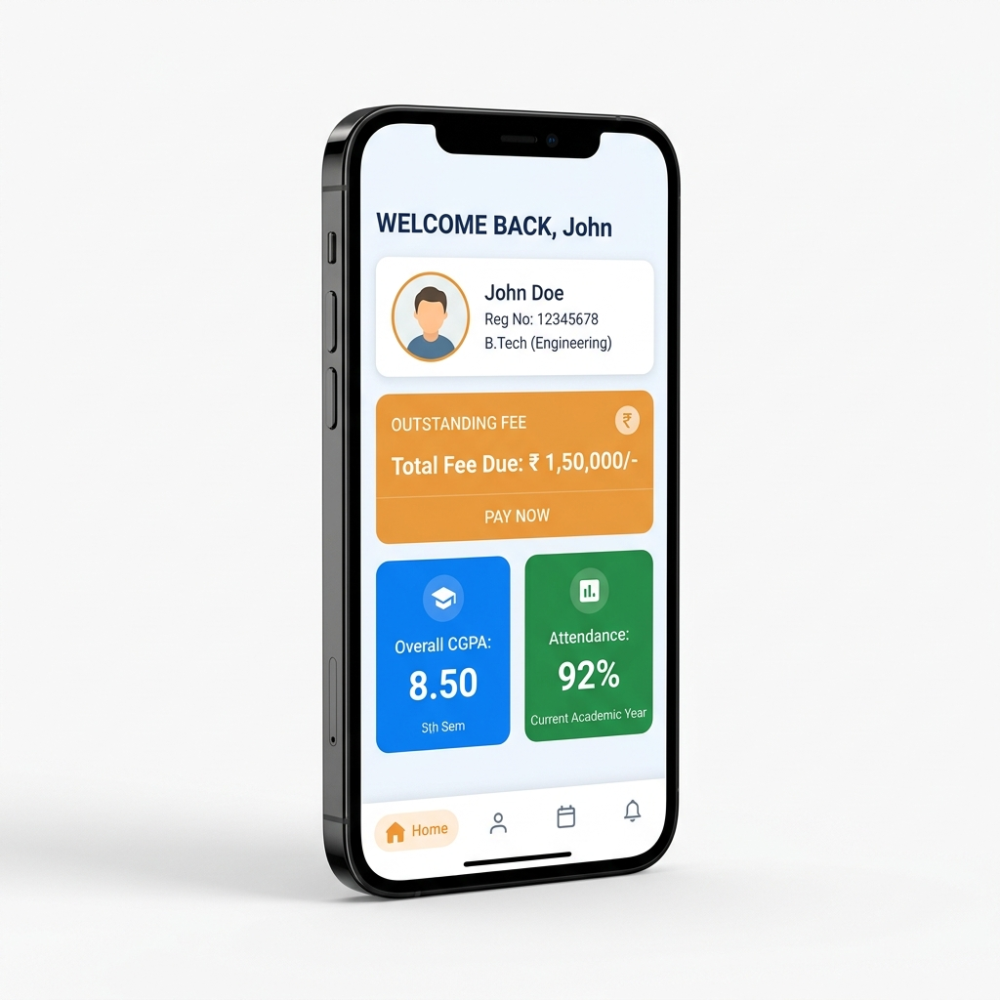
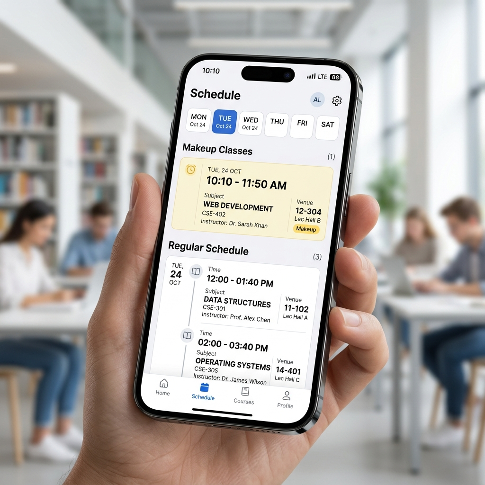
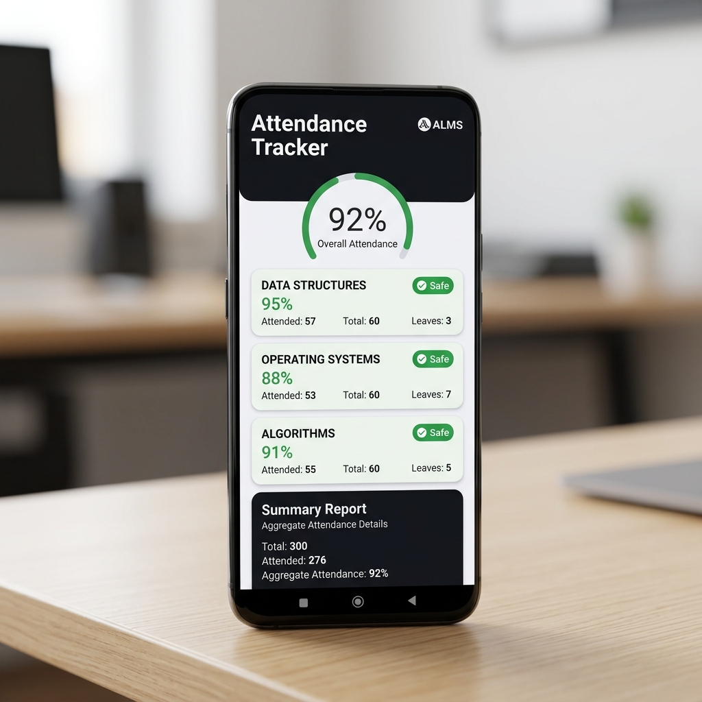
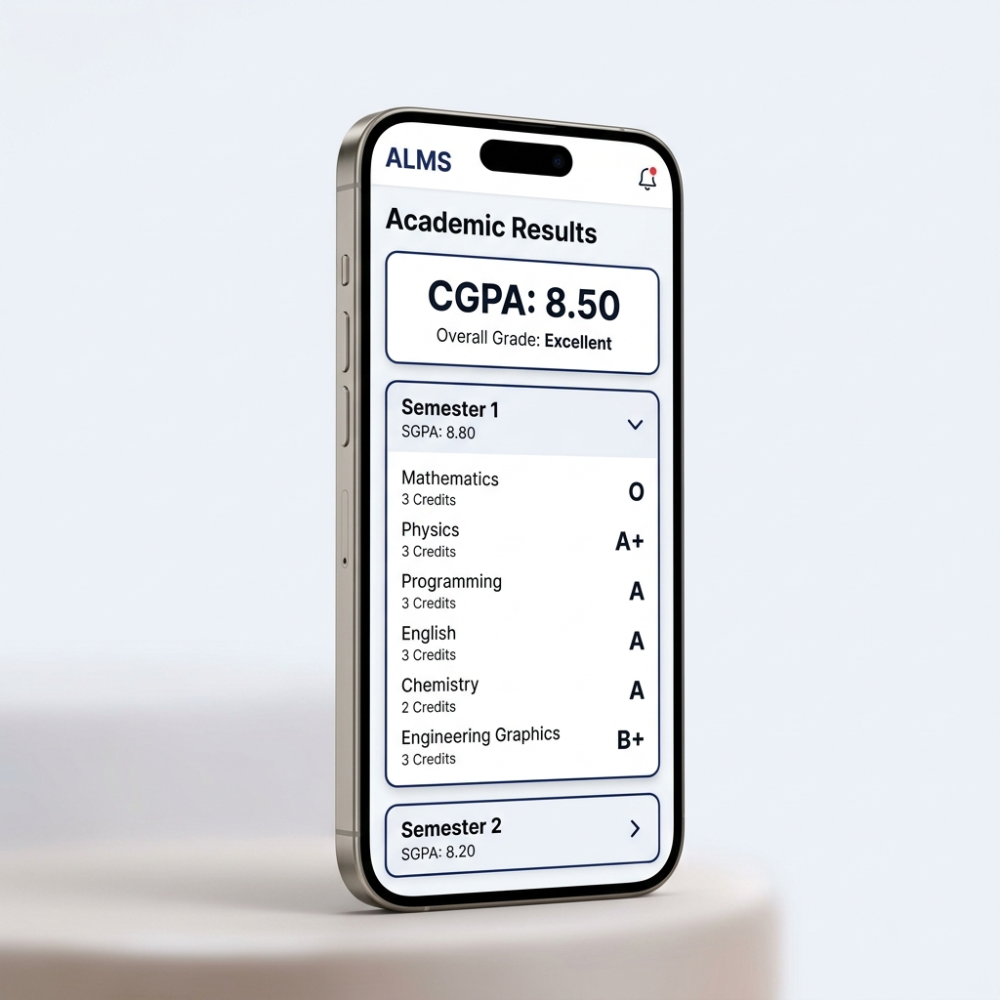

# ALMS - Ashish Learning Management System 🚀

### 📥 [**Download ALMS (Latest APK)**](https://github.com/Ashishshankar26/ALMS/releases)

**Take control of your academic life at Lovely Professional University with ALMS.**

ALMS is a premium, native mobile application designed by a student, for students. It eliminates the need to navigate slow web portals by providing a fast, beautiful, and integrated experience for all your UMS data.

---

## ✨ Features

### 📅 **Smart Timetable**
- Access your weekly schedule instantly.
- **Makeup Classes & Adjustments**: Stay ahead with clearly marked makeup classes, including the specific dates they are assigned to.

### 📊 **Attendance & Results**
- View your overall and subject-wise attendance with portal-consistent accuracy.
- **Detailed Results**: Access your CGPA and semester-wise results in a native breakdown.

### 📝 **Exams & Fees**
- **Upcoming Exams**: Quick access to your exam seating plans and datesheets.
- **Fee Dashboard**: View your pending and paid fees directly in the app.

### 💬 **Restored Messages**
- Access your university notifications and personal messages in a native chat-like interface.

### 💡 **Special Feature: Integrated Leave Management**
- **One-Page Leave**: Apply for leave and view your leave slips side-by-side in one integrated page.
- **No Browser Needed**: Complete the entire leave process within the app without ever opening an external web browser.

---

## 📸 Screenshots

  
  
  
  

---

## 📦 Installation

1. Click on [**Download ALMS**](https://github.com/Ashishshankar26/ALMS/releases).
2. Download the latest **`ALMS.apk`** from the assets section.
3. Install and log in with your UMS credentials.
4. *Note: If prompted, click "Install Anyway" (Standard for student-built APKs).*

---

## 🔒 Privacy
Your data is yours. ALMS handles your login credentials locally on your device to fetch data directly from the official portal. No data is shared with third parties.

---

**Developed by Ashish Shankar**
